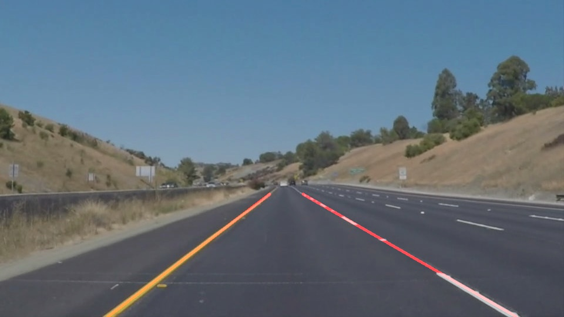

# **Finding Lane Lines on the Road** 

## By Akash Chauhan - आकाश चौहान 

### This is the first project in my Self Driving Cars Nanodegree and this write up summarizes how did i proceed with it

---

**Finding Lane Lines on the Road**

The goals / steps of this project are the following:
* Make a pipeline that finds lane lines on the road
* Reflect on your work in a written report

---

### Reflection

### 1. Describe your pipeline. As part of the description, explain how you modified the draw_lines() function.

My pipeline consisted of 5 steps. First, 

1. Converting the image to grayscale:  
```
gray = grayscale(image)
```
It is not an good idea to work with the colored images for this project, but later it may be good to divide the image into different channels work and then combine the result. GrayScale will make it easy/fast to process.
2. Noise reduction
```
gray = gaussian_blur(gray, 5)
```
At this stage, the image may contain some noises, so its better to do a gaussian blur, with the defined kernal, it averages over the data, basically smoothes the data or image over a region.
3. Finding region of interest
```
edges = canny(gray, 50, 150)
imshape = image.shape
vertices = np.array([[(.51*imshape[1], imshape[0]*.58), (.49*imshape[1], imshape[0]*.58), (0, imshape[0]), (imshape[1], imshape[0])]], dtype=np.int32)

target = region_of_interest(edges, vertices)
```
It would be a waste of resources if we run the algorithm on the whole image, instead, we will constraint to a region of interest, typically somewhere the lower half of the image.
To find the lanes, we must first find the edges, here we used the canny edge detection algorithm and then the vertices of the region.
7. Hough transformation:
```
lines = hough_lines(target, 1, np.pi/180, 35, 5, 2)
```
This one is the most interesting part, here we will find the lines of our interest with the help of hough transformation
8. Combining the found lines with the original image
```
result = weighted_img(lines, image, α=0.8, β=1.)
```




### 2. Identify potential shortcomings with your current pipeline


Shortcomings
1. This is not tested on the different daylight scenarios, since the image is grayscale, it may have difficulty with the yellow lines
2. Does not work very well with the too much noise cases, like the challenge scenario
3. It does not take into account video nature of the datastream to correct out the noises, so, if a particular image has noise, it may affect the result considerably


### 3. Suggest possible improvements to your pipeline

1. For continous nature, histogram may be helpful
2. Running algorithm on different channels and then combining the result